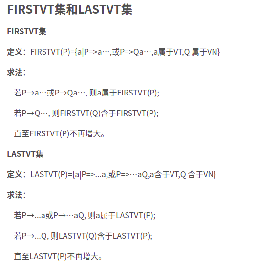

* 算符文法：
  任何一个规则右部都不存在两个非终结符相邻的情况。如 AB
* 算符优先文法(OPG文法)
  1. 不含空
  2. 三个优先关系只有一个成立

本例采用的文法如下：
$$
\begin{aligned}
&(1)E \rightarrow E+T|T \\
&(2)T \rightarrow T*F|F \\  
&(3)F \rightarrow(E)| i\\
\end{aligned}
$$

* firstVT和lastVT的求法
