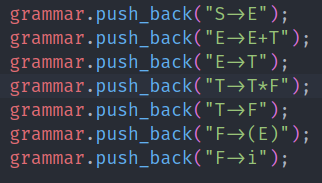
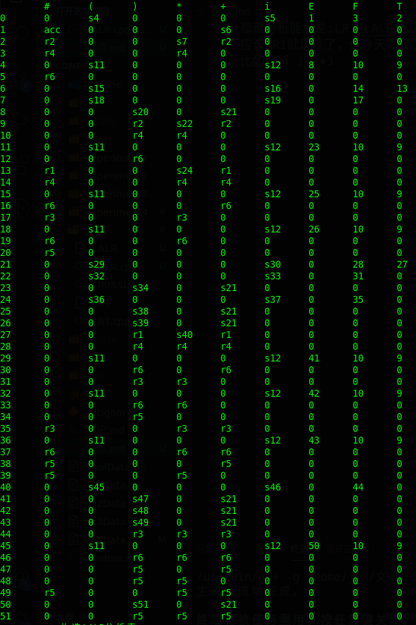
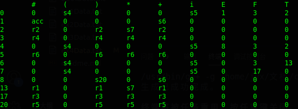

都说分析能力是:LR1>LALR>SLR>LR0
应该LR1就足以了，但实现了由LR1构造LALR分析表之后，发现LALR分析表不仅少，而且分析能力更强：
* 比如有文法如下

* 构造的LR1分析表如下，分析语句"1+2*3#"：
  1. 从状态0读入'i'转状态5
  2. 从状态5读入'+'，就发生了错误
  * 

* 对LR1的同心状态进行合并，得到LALR分析表如下，同样分析"1+2*3#":
  1. 状态0读入'i'转状态5,读头后移
        * 状态栈:05      
        * op栈:i 
  2. 状态5读入'+'进行r6规约，i规约为F，弹出状态5，从状态0读入F转状态3
        * 状态栈:03      
        * op栈:F 
  3. 状态3读入'+'进行r4规约，F规约为T，弹出状态3，从状态0读入T转状态2
        * 状态栈:02      
        * op栈:T 
  4. 状态2读入'+'进行r2规约，T规约为E，弹出状态2，从状态0读入E转状态1
        * 状态栈:01      
        * op栈:E 
  5. 状态1读入'+'转状态6，读头后移
        * 状态栈:016      
        * op栈:E+ 
  6. 状态6读入'i'转状态5，读头后移
        * 状态栈:0165      
        * op栈:E+i 
  7. 状态5读入'*'进行r6规约，i规约为F，弹出状态5，从状态6读入F转状态3
        * 状态栈:0163      
        * op栈:E+F 
  8. 状态3读入'*'进行r4规约，F规约为T，弹出状态3，从状态6读入T转状态13
        * 状态栈:016 $13$      
        * op栈:E+T 
  9.  状态13读入'*'转状态7，读头后移
        * 状态栈:016 $13$ 7      
        * op栈:E+T* 
  10. 状态7读入'i'转状态5，读头后移
        * 状态栈:016 $13$ 75      
        * op栈:E+T*i 
  11. 状态5读入'#'进行r6规约，i规约为F，弹出状态5，从状态7读入F转状态17
        * 状态栈:016 $13$ 7 $17$      
        * op栈:E+T*F 
  12. 状态17读入'#'进行r3规约，T*F规约为T，弹出状态17、7、13，从状态6读入T转状态13
        * 状态栈:016 $13$       
        * op栈:E+T 
  13. 状态13读入'#'进行r1规约，E+T规约为E，弹出状态13、6、1，从状态0读入E转状态1
        * 状态栈:01       
        * op栈:E
  14. 状态1读入"#"：acc，分析成功
  * 
