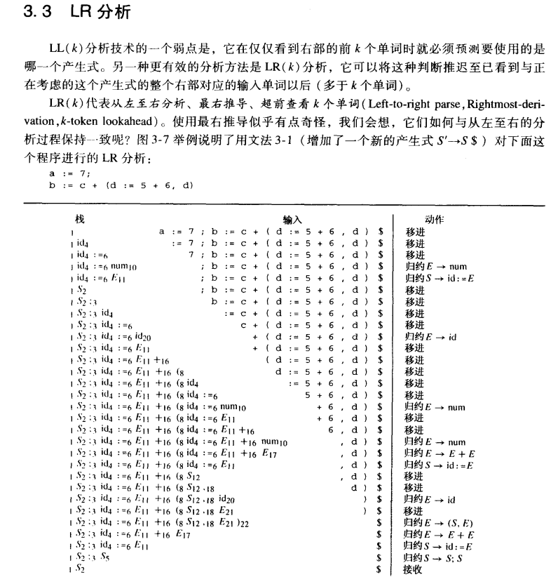
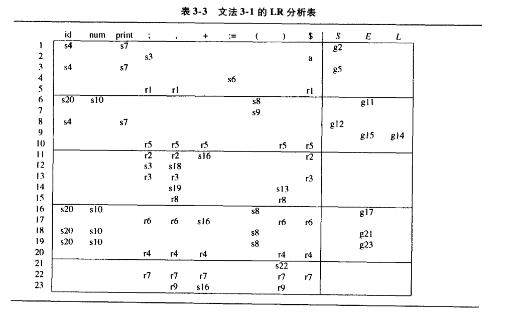
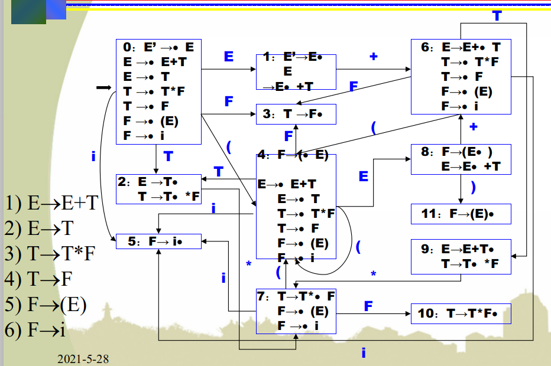

终结符来自字母表中的单词
变量名和数字是和单词关联的语义值

具有左递归的文法不是LL(1)文法
LL(1)文法：从左至右分析、最左推导、超前查看一个符号

要计算nullable、FIRST、FOLLOW集来得到预测分析表

* moocLR(0)分析示例
分析表.png)
其中，$I_1$是接收状态，只有遇到才接收。 
与$I_1$不同，$I_4$是规约状态，全都用3号产生式规约
$I_5和I_6$同理
q：不是只有移进项目(S->·bBB)、待约项目(S->b·BB)和规约项目(S->bBB·)吗。
a：增广文法的目的是使得文法开始符号仅出现在一个产生式的左边，使得分析器只有一个**接受状态**

* SLR分析
当LR(0)存在冲突，或是规约-规约冲突、或是移进-规约冲突时，对于存在冲突的状态，如(E->T·和T->T·*F)，查看规约的项目(E->T)，若规约后的非终结符E的follow集不含有移进的终结符符号 * ，则不进行规约，因为规约后无法接受该终结符 * ，故采取移进动作。
其次，在LR(0)文法中，只要存在规约项目，该状态下的所有终结符都用该产生式进行规约(一行里面全是$r_n$)。但在SLR分析中，只有规约产生式左部的非终结符的follow集包含的终结符才进行规约。
简单的说，非终结符的follow集包含的终结符才进行规约。
SLR一样会产生冲突，当待规约的项的左部的follow含有a，a规约，若a同样能使得状态移进时，则产生了冲突。

# 其他
* 对于map类型，若要查看某个key是否在map中，不可直接map[key]不然会自动创建一个新的映射
map<string, int> VT2int; 
VT2int.count(Y[i]); 这种方法返回值只是0或1，0代表没有这个key，1代表有